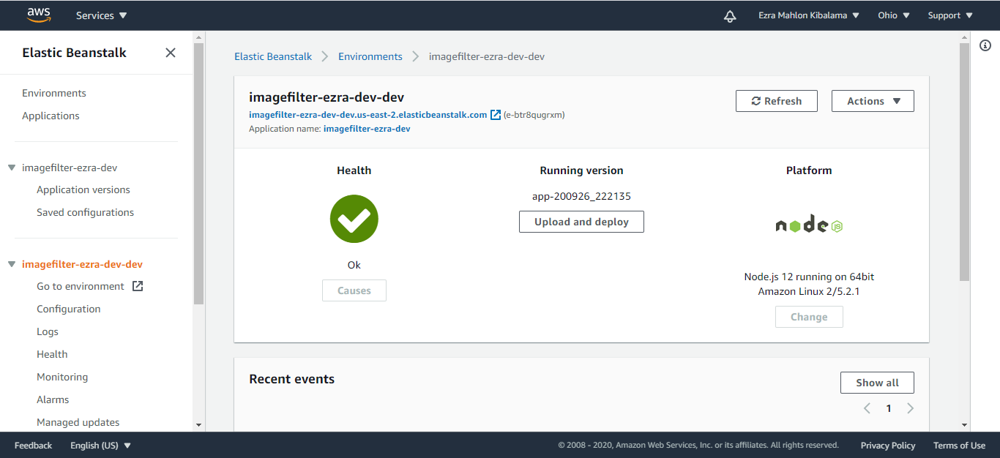

# Udagram Image Filtering Microservice
In this project I deploy an image filtering Node Js application using Elastic Beanstalk CLI

### Clone Repository and then Setup Node Environment

You'll need to create a new node server. Open a new terminal within the project directory and run:

1. Initialize a new project: `npm i`
2. run the development server with `npm run dev`

### Deploying your system

Follow the process described in the course to `eb init` a new application and `eb create` a new environment to deploy your image-filter service! Don't forget you can use `eb deploy` to push changes.

###On Successful Deployment
Image showing Elastic Beanstalk has been set up

###Link to AWS Deployment
1. URL to Image being processed : https://upload.wikimedia.org/wikipedia/commons/thumb/1/15/White_Persian_Cat.jpg/220px-White_Persian_Cat.jpg

2. Home URL : http://imagefilter-ezra-dev-dev.us-east-2.elasticbeanstalk.com/

3. Link to uploaded file : http://imagefilter-ezra-dev-dev.us-east-2.elasticbeanstalk.com/filteredimage?image_url=https://upload.wikimedia.org/wikipedia/commons/thumb/1/15/White_Persian_Cat.jpg/220px-White_Persian_Cat.jpg
